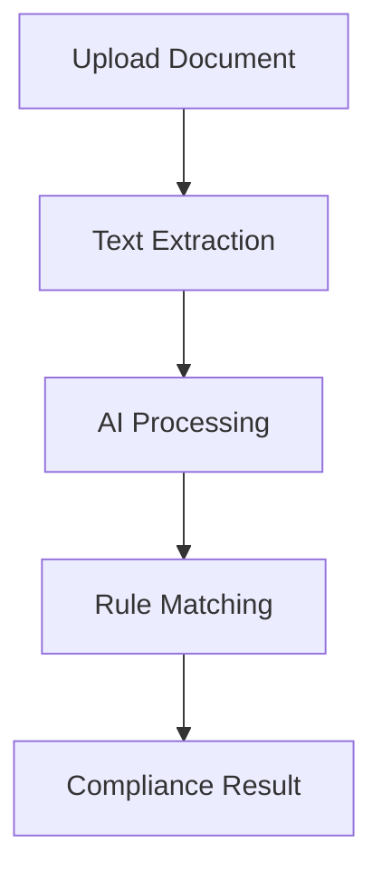

<h1 align="center">🤖 AI Regulatory Compliance Checker</h1>

<p align="center">
  
</p>

<p align="center">
  
  
  
  
</p>

---

## 🚀 About The Project

The **AI Regulatory Compliance Checker** is a smart system that analyzes documents and checks whether they meet regulatory and policy requirements using AI.

Instead of manually reviewing large documents, this tool automates the entire process — saving time and improving accuracy.

---

## 🎬 Demo Preview

<p align="center">
  
</p>

> ⚡ Replace this with your actual project demo for best impact

---

## ✨ Features

✔️ Upload and analyze documents  
✔️ AI-powered compliance validation  
✔️ Fast and automated processing  
✔️ Detect missing or incorrect rules  
✔️ Clear results and insights  
✔️ Simple and user-friendly UI  

---

## 🛠️ Tech Stack

| Technology | Usage |
|----------|------|
| Python | Core logic |
| Streamlit | Frontend UI |
| Machine Learning | AI processing |
| Pandas / NumPy | Data handling |
| Scikit-learn | Model building |
| Google Sheets API | Optional integration |

---

## 🧠 How It Works


---

## ⚙️ Installation & Setup

Follow these steps to run the project locally:

### 1️⃣ Clone the Repository

```bash
git clone https://github.com/ruchikakengal/AI-Powered-Regulatory-Compilance-Checker.git
```

### 2️⃣ Navigate to Project Folder

```bash
cd AI-Powered-Regulatory-Compliance-Checker
```

### 3️⃣ Create Virtual Environment (Recommended)

```bash
python -m venv venv
```

### 4️⃣ Activate Virtual Environment

**For Windows:**

```bash
venv\Scripts\activate
```

**For Mac/Linux:**

```bash
source venv/bin/activate
```

### 5️⃣ Install Dependencies

```bash
pip install -r requirements.txt
```

### 6️⃣ Run the Application

```bash
streamlit run app.py
```

---

## 🎯 Use Cases

* 📄 Compliance verification
* ⚖️ Legal document analysis
* 📊 Audit preparation
* 📑 Policy validation

---

## 🔮 Future Enhancements

* 🤖 LLM Integration (ChatGPT / Gemini)
* 📊 Advanced analytics dashboard
* 📄 PDF report generation
* 🌍 Multi-language support
* 🔗 Live regulation APIs

---
## 👩‍💻 Author

<p align="center">
  <span style="font-size:35px; font-weight:bold; color:#FF4B91;">
  ✨ Ruchika Kengal ✨
  </span><br><br>

  💻 Computer Science & Engineering Student <br>
  🚀 AI & Web Developer <br>
</p>

<p align="center">
  
</p>

---

## ⭐ Show Your Support

<p align="center">
  
</p>

If you like this project, give it a ⭐ on GitHub!

---

## 📬 Connect With Me

<p align="center">
  <a href="https://github.com/ruchikakengal">
    
  </a>
  <a href="https://www.linkedin.com/in/rutika-kengal-b3b0a22b7/](https://www.linkedin.com/in/ruchika-kengal-8085092b7/)">
    
  </a>
</p>

---

## 📄 License

This project is licensed under the MIT License.

---
